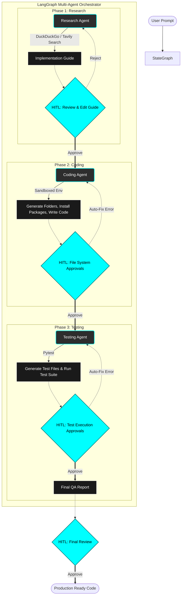

# Multi-Agent LangGraph Coding System

This repository contains a robust, multi-agent system powered by **LangGraph**, designed to autonomously research, write, and test software projects based on simple user prompts. The system heavily prioritizes **safety** and strict **Human-In-The-Loop (HITL)** interactions, ensuring that it never takes a destructive action without explicit user approval.

## High-Level Architecture

The pipeline uses **LangGraph** to orchestrate three primary AI agents. They share a central `AgentState` that holds the project context, reasoning traces, generated code, and audit logs. At critical junctions, the graph relies on `interrupt()` mechanisms to pause execution and prompt the human for review.



### 1. Research Agent (`agents/research_agent.py`)
**Role:** Planning and architecture design.
* Takes the user's raw prompt (e.g., "Build a FastAPI REST API").
* Uses DuckDuckGo/Tavily via `search_tools.py` to search for modern best practices, suitable libraries, and folder structures.
* Outputs a detailed "Implementation Guide" outlining the stack and steps.
* **HITL Gate:** The user is asked to `APPROVE`, `REJECT` (with feedback to regenerate), or `EDIT` (paste their own multi-line guide) before moving to the next agent.

### 2. Coding Agent (`agents/coding_agent.py`)
**Role:** Code generation and environment setup.
* Parses the approved implementation guide to extract the folder tree and required libraries.
* Creates the physical directories inside a sandboxed folder.
* Generates all required Python scripts, HTML files, configuration files, etc.
* **HITL Gates:**
  * **CREATE FOLDER STRUCTURE:** Approves the bulk creation of the folder tree.
  * **PACKAGE INSTALLATION:** Approves the `pip install` of third-party libraries.
  * **CREATE FILE:** Approves each individual generated file. Shows a preview; allows the user to paste their own manual edits if the AI hallucinated.
* **Auto-Fix Loop:** Automatically tries to run the project. If it crashes, the agent reads `stderr`, proposes a fix, asks for user approval (`AUTO-FIX CODE` gate), and attempts to run it again (up to 3 times).

### 3. Testing Agent (`agents/testing_agent.py`)
**Role:** Quality assurance and verification.
* Uses `pytest` to run automated test suites against the generated codebase.
* Analyzes coverage reports and logs failures.
* Proposes automatic test fixes and runs them recursively with user approval.
* Generates a final Markdown QA report and surfaces it to the user.

---

## Tooling & Safety Mechanisms

The system uses standard LangChain tools, but wraps them in rigid safety sandboxes:

* **Terminal UI (`ui/terminal_ui.py`)**: A Rich-based, Aqua-themed (`#00FFFF`) terminal interface. It displays reasoning traces cleanly and manages the interactive `request_approval` system. It keeps an audit log of every decision the human makes and properly handles multiline inputs.
* **Search Tools (`tools/search_tools.py`)**: Provides `web_search` and `deep_search` capabilities using the `duckduckgo-search` package (and optionally Tavily).
* **Terminal Tools (`tools/terminal_tools.py`)**: Executes shell commands with strict timeouts. Uses regex blocklists to prevent destructive commands (e.g., `rm -rf /`, `mkfs`, `shutdown`). Includes its own HITL gate before execution.
* **Filesystem Tools (`tools/filesystem_tools.py`)**: Restricts all file writes to the `./output/generated_code/` directory to prevent the agent from accidentally overwriting system files. Creating or overwriting a file triggers a HITL gate showing a preview or a unified diff.

## The Human-In-The-Loop (HITL) Workflow

When the system reaches a critical action, it invokes the LangGraph `interrupt()` mechanism, pausing execution and saving the graph state. It prints a Rich panel:

```text
┌───   !! HUMAN APPROVAL REQUIRED !! ────┐
│   Action Type:  PACKAGE INSTALLATION   │
│   Details:      fastapi, uvicorn       │
│   Options: APPROVE / REJECT / EDIT     │
└────────────────────────────────────────┘
  Your decision > 
```

* **APPROVE**: The action executes immediately, and the graph resumes.
* **REJECT**: The action is blocked. A `HumanRejectedError` is raised, forcing the agent to reason about the failure and try an alternative approach.
* **EDIT**: The user is prompted to type or paste a corrected version of the payload (e.g., rewriting a generated script manually before it saves) by using a multiline input loop closed with `---END---`.

## Setup & Running

1. Install dependencies:
   ```bash
   pip install -r requirements.txt
   ```
2. Configure environment variables:
   Copy `.env.example` to `.env` and add your keys.
   ```env
   GROQ_API_KEY=your_groq_api_key
   ```
3. Run the complete Multi-Agent Pipeline:
   ```bash
   python main.py
   ```
