# 📚 Multi-Agent System for Coding — Documentation Hub

Welcome! This is the central hub for all documentation about the **Multi-Agent System for Coding** project. Whether you are a student, a beginner, or an experienced developer, you will find clear explanations here.

---

## 🗺️ Documentation Map

The diagram below shows how all the documents relate to each other. Start with the top and work your way down.

```mermaid
graph TD
    README["📚 docs/README.md\n(You are here)"]

    README --> PO["📋 Project Overview"]
    README --> SA["🏛️ System Architecture"]
    README --> AA["🤖 Agent Architecture"]
    README --> WF["🔄 Workflows"]
    README --> FS["📁 Folder Structure"]
    README --> IN["⚙️ Installation Guide"]
    README --> CF["🔑 Configuration Guide"]
    README --> AP["🔌 API Documentation"]
    README --> DB["🗄️ Database"]
    README --> DP["🚀 Deployment Guide"]
    README --> SC["🔒 Security"]
    README --> TS["🛠️ Troubleshooting"]
    README --> DG["👨‍💻 Developer Guide"]
    README --> GL["📖 Glossary"]

    style README fill:#006666,color:#00ffff,stroke:#00ffff
    style PO fill:#1a1a1a,color:#ffffff,stroke:#00ffff
    style SA fill:#1a1a1a,color:#ffffff,stroke:#00ffff
    style AA fill:#1a1a1a,color:#ffffff,stroke:#00ffff
    style WF fill:#1a1a1a,color:#ffffff,stroke:#00ffff
```

---

## 📑 Quick Navigation

| # | Document | What you will learn |
|---|----------|---------------------|
| 1 | [📋 Project Overview](project-overview.md) | What the project does and why it was built |
| 2 | [🏛️ System Architecture](system-architecture.md) | How all the pieces fit together |
| 3 | [🤖 Agent Architecture](agent-architecture.md) | The three AI agents and their jobs |
| 4 | [🔄 Workflows](workflows.md) | Step-by-step flow from user input to finished code |
| 5 | [📁 Folder Structure](folder-structure.md) | Every file and folder explained |
| 6 | [⚙️ Installation Guide](installation.md) | How to set up and run the project |
| 7 | [🔑 Configuration Guide](configuration.md) | Environment variables and API keys |
| 8 | [🔌 API Documentation](api-documentation.md) | All tools and their inputs/outputs |
| 9 | [🗄️ Database](database.md) | How data flows through the system |
| 10 | [🚀 Deployment Guide](deployment.md) | How to deploy to production |
| 11 | [🔒 Security](security.md) | How the system stays safe |
| 12 | [🛠️ Troubleshooting](troubleshooting.md) | Common problems and how to fix them |
| 13 | [👨‍💻 Developer Guide](developer-guide.md) | How to contribute and extend the project |
| 14 | [📖 Glossary](glossary.md) | Definitions of every technical term used |

---

## 🎯 Recommended Reading Order

**If you are new to the project**, follow this order:

1. 📋 [Project Overview](project-overview.md) — understand the "big picture"
2. ⚙️ [Installation Guide](installation.md) — get it running on your computer
3. 🔑 [Configuration Guide](configuration.md) — add your API keys
4. 🔄 [Workflows](workflows.md) — see the system in action
5. 🤖 [Agent Architecture](agent-architecture.md) — learn how each AI agent works
6. 🏛️ [System Architecture](system-architecture.md) — understand the technical design
7. 📁 [Folder Structure](folder-structure.md) — explore the codebase
8. 👨‍💻 [Developer Guide](developer-guide.md) — start contributing
9. 📖 [Glossary](glossary.md) — look up any unfamiliar terms

---

## 💡 Key Facts at a Glance

| Property | Value |
|----------|-------|
| **Language** | Python 3.10+ |
| **Main Framework** | LangGraph |
| **LLM Provider** | Groq (llama-3.3-70b-versatile) |
| **Web Search** | DuckDuckGo (free) + Tavily (optional) |
| **Terminal UI** | Rich library (Aqua theme) |
| **Number of AI Agents** | 3 (Research, Coding, Testing) |
| **Human Approval Gates** | Yes — every system action requires approval |
| **Output Location** | `output/generated_code/` (sandboxed) |

---

> **Need help?** See the [Troubleshooting Guide](troubleshooting.md) or the [Glossary](glossary.md) for definitions.
