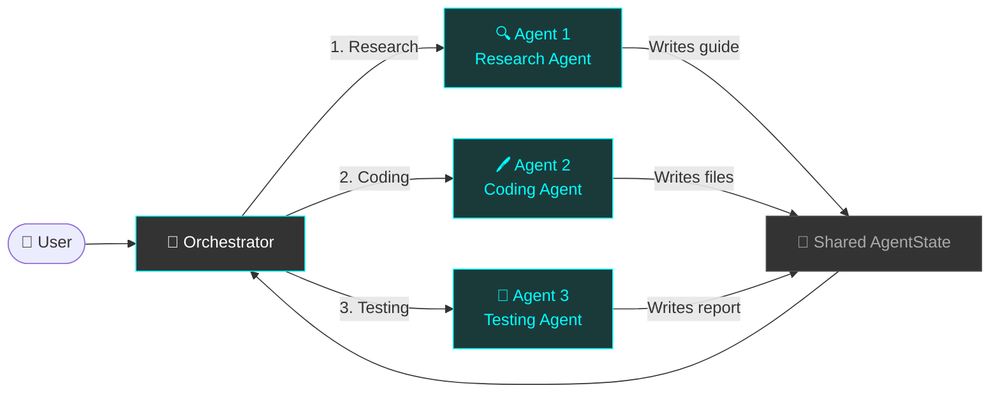
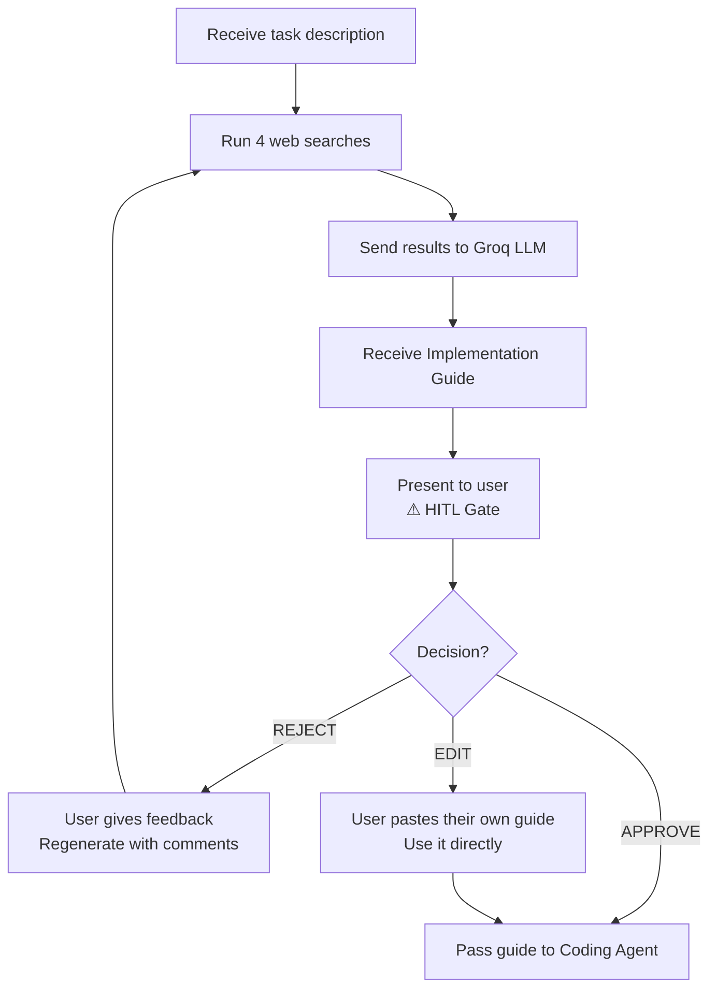
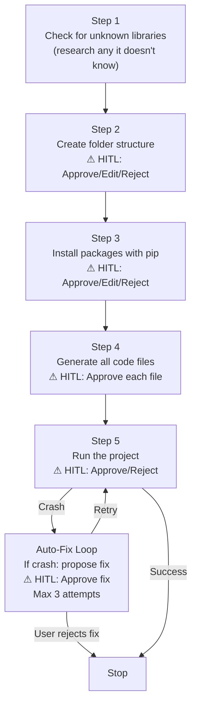
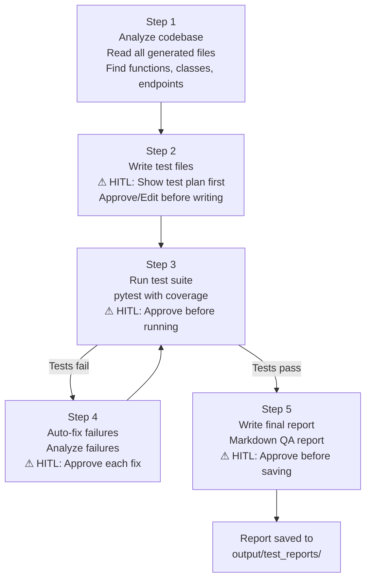
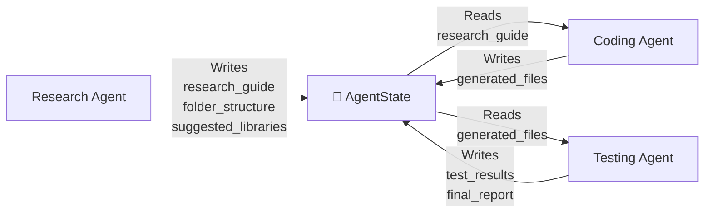

# 🤖 Agent Architecture

> **Back to** [Documentation Hub](README.md)

---

## What Is an Agent?

An "agent" is a piece of software that can **think, make decisions, and take actions** to complete a goal.

In this project, each agent is powered by an AI language model (Groq's `llama-3.3-70b-versatile`). When no API key is configured, agents run in **MOCK mode** — they still go through every step but produce pre-written example outputs instead of calling the AI.

---

## The Three Agents



---

## Agent 1: Research Agent

**File:** `agents/research_agent.py`  
**LLM Model:** `llama-3.3-70b-versatile` via Groq

### What it does

The Research Agent is like a **senior software architect** preparing a project plan. It:

1. Receives the user's project description (e.g., *"Build a REST API"*)
2. Runs **4 web searches** in parallel:
   - Best architecture patterns
   - Recommended Python libraries (with versions)
   - Common pitfalls to avoid
   - Ideal folder structure
3. Sends all search results to the Groq LLM
4. Receives a structured **Implementation Guide** in return
5. Presents the guide to the user for approval

### Inputs and Outputs

| Input (from AgentState) | Output (to AgentState) |
|------------------------|------------------------|
| `task` (user's description) | `research_guide` (full Markdown guide) |
| `research_comments` (feedback from previous run) | `folder_structure` (extracted ASCII tree) |
| | `suggested_libraries` (list of pip packages) |

### Decision-Making Process



### The Implementation Guide Structure

The Research Agent always generates a guide with these exact sections:

```
## Project Overview
## Recommended Libraries       ← pip install commands
## Folder Structure            ← ASCII directory tree
## Implementation Steps        ← Numbered steps (5-10)
## Potential Challenges & Solutions  ← Table format
## Estimated Complexity        ← Low/Medium/High per component
```

---

## Agent 2: Coding Agent

**File:** `agents/coding_agent.py`  
**LLM Model:** `llama-3.3-70b-versatile` via Groq

### What it does

The Coding Agent is like a **senior software developer** who takes the architect's plan and actually builds the project. It runs through 5 sequential steps:



### Inputs and Outputs

| Input (from AgentState) | Output (to AgentState) |
|------------------------|------------------------|
| `research_guide` | `generated_files` (dict of path → content) |
| `folder_structure` | Updated `step_log` |
| `suggested_libraries` | |

### Safety Controls

- **Folder sandbox:** All directories are created inside `output/generated_code/` only
- **Package approval:** Every `pip install` command requires your approval first
- **File preview:** Before writing any file, it shows you a preview (first 30 lines)
- **Edit option:** You can paste your own version of any file if the AI output is wrong

---

## Agent 3: Testing Agent

**File:** `agents/testing_agent.py`  
**LLM Model:** `llama-3.3-70b-versatile` via Groq

### What it does

The Testing Agent is like a **QA engineer** who verifies everything works correctly. It runs through 5 steps:



### What tests it writes

For each module found in `generated_files`, the Testing Agent generates:

| Test Type | What it covers |
|-----------|---------------|
| **Unit tests** | Every function tested individually |
| **Edge cases** | Empty input, None values, wrong types |
| **Integration tests** | API endpoints tested with `httpx` |
| **Mocking** | External dependencies replaced with fakes |

### Inputs and Outputs

| Input (from AgentState) | Output (to AgentState) |
|------------------------|------------------------|
| `generated_files` | `test_results` (pytest output) |
| `folder_structure` | `final_report` (Markdown) |
| | Updated `step_log` |

---

## How Agents Communicate

Agents do **not** talk to each other directly. They communicate **only through the shared `AgentState`**:



This design means:
- Each agent is **independent** — you can test any one by itself
- The orchestrator can **replay or restart** any step without affecting others
- All data is **stored in state** and can be inspected at any time

---

## HITL (Human In The Loop) Gates Per Agent

| Agent | Gate | Options |
|-------|------|---------|
| Research | Review Implementation Guide | APPROVE / REJECT / EDIT |
| Coding | Approve folder structure | APPROVE / REJECT / EDIT |
| Coding | Approve package installation | APPROVE / REJECT / EDIT |
| Coding | Approve each code file | APPROVE / REJECT / EDIT |
| Coding | Approve running the project | APPROVE / REJECT / EDIT |
| Coding | Approve auto-fix | APPROVE / REJECT / EDIT |
| Testing | Approve test file plan | APPROVE / REJECT / EDIT |
| Testing | Approve running pytest | APPROVE / REJECT |
| Testing | Approve test auto-fix | APPROVE / REJECT / EDIT |
| Testing | Approve final QA report | APPROVE / REJECT / EDIT |

---

## Key Takeaways

> - **3 agents** work in sequence: Research → Coding → Testing
> - Agents share data through **AgentState** — they never call each other directly
> - Every agent works in **MOCK mode** without a Groq API key (great for testing)
> - Every major action is protected by a **HITL approval gate**

---

**Next:** [Workflow Documentation →](workflows.md)
