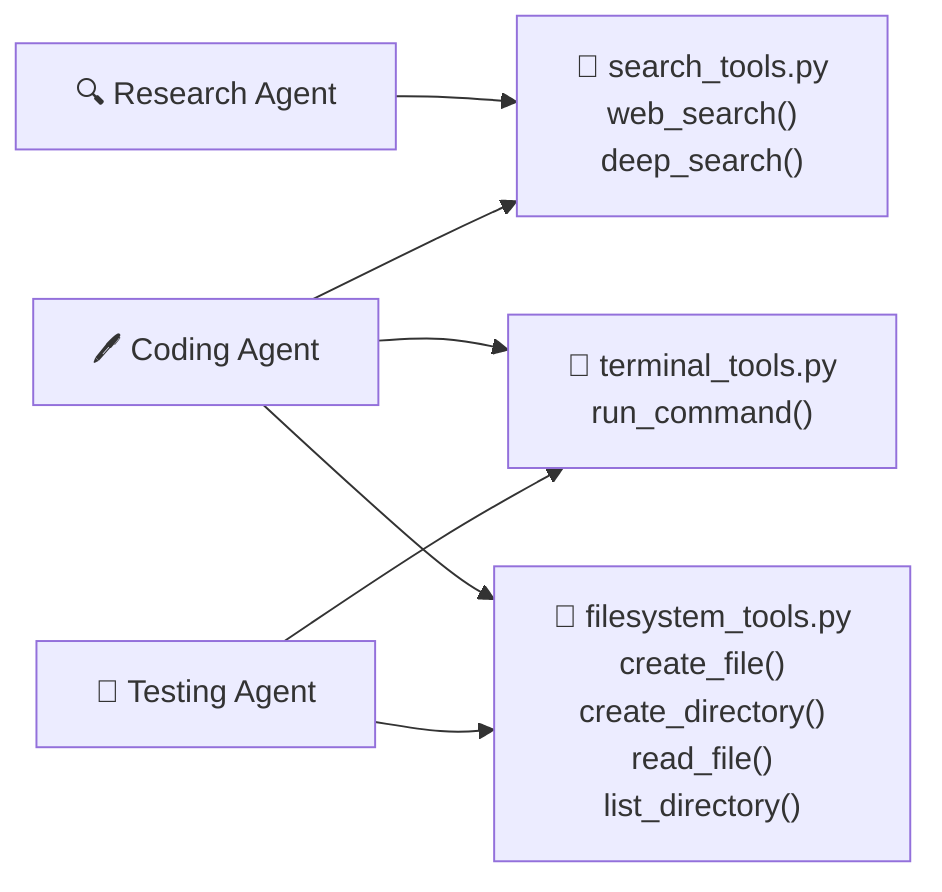

# 🔌 API Documentation — Tools Reference

> **Back to** [Documentation Hub](README.md)

---

## What Are "Tools" in This System?

In LangGraph / LangChain, a **tool** is a function that an AI agent can call to interact with the outside world — searching the web, running a command, writing a file, etc.

This project has three tool files. Each tool is decorated with `@tool` which makes LangChain aware of it and lets agents call it by name.

---

## Tool Files Overview



---

## Search Tools (`tools/search_tools.py`)

> 📌 **No approval required** — these are read-only operations.

### `web_search(query)`

Search the web and return the top 5 results.

**Parameters:**
| Parameter | Type | Description |
|-----------|------|-------------|
| `query` | `str` | The search query (e.g., `"FastAPI JWT tutorial"`) |

**Returns:** `str` — formatted list of results

**Example call:**
```python
result = web_search.invoke({"query": "langgraph multi-agent examples"})
```

**Example output:**
```
[DuckDuckGo]
1. LangGraph Quickstart
   URL: https://langchain-ai.github.io/langgraph/...
   A quickstart guide to building multi-agent workflows...

2. Multi-Agent Coordination Patterns
   URL: https://example.com/...
   Best practices for coordinating multiple AI agents...
```

**How it works:**
1. Searches DuckDuckGo (always, no key needed)
2. If `TAVILY_API_KEY` is set, appends Tavily results
3. Caps display at 1200 characters to avoid overwhelming the UI

---

### `deep_search(query)`

Run 3 parallel searches with query variations and merge results.

**Parameters:**
| Parameter | Type | Description |
|-----------|------|-------------|
| `query` | `str` | The base search query |

**Returns:** `str` — merged, deduplicated results from up to 10 sources

**How it works:**
1. Creates 3 query variants:
   - `query` (original)
   - `{query} best practices`
   - `{query} tutorial guide 2024`
2. Runs all 3 in **parallel** using a thread pool
3. Deduplicates results by URL
4. Returns the top 10 unique results

**When to use it:** The Research Agent uses `web_search` for speed. `deep_search` is available for cases where you need broader coverage.

---

## Terminal Tools (`tools/terminal_tools.py`)

> ⚠️ **HITL approval required** — user must approve before any command runs.

### `run_command(command, working_dir)`

Execute a shell command safely after human approval.

**Parameters:**
| Parameter | Type | Default | Description |
|-----------|------|---------|-------------|
| `command` | `str` | — | The shell command to run (e.g., `"python main.py"`) |
| `working_dir` | `str` | `"."` | Directory to run in |

**Returns:** `dict`
```python
{
    "exit_code": 0,           # 0 = success, non-zero = error
    "stdout": "Hello World",  # Standard output
    "stderr": "",             # Error output
    "approved_by_human": True,
    "command_used": "echo Hello World"  # May differ if user edited it
}
```

**Raises:**
- `ValueError` — if the command matches a dangerous pattern (always blocked)
- `HumanRejectedError` — if the user types REJECT
- `subprocess.TimeoutExpired` — if the command runs longer than 60 seconds

**Safety: Blocked Patterns**

These patterns are **always blocked**, even if you type APPROVE:

| Blocked Pattern | Why |
|-----------------|-----|
| `rm -rf /` | Deletes everything on the system |
| `sudo` | Escalates privileges dangerously |
| `format` | Formats disk drives |
| `mkfs` | Creates a new filesystem (wipes data) |
| `dd of=/dev/` | Writes directly to disk device |
| `shutdown` | Powers off the machine |
| `reboot` / `halt` | Restarts the machine |

**Example:**
```
⚠ HUMAN APPROVAL REQUIRED
  Action  : SHELL COMMAND
  Target  : pip install fastapi
  Risk    : System modification
  ──────────────────────────────
  [A] APPROVE   [R] REJECT   [E] EDIT
  > A

✓ Human approved SHELL COMMAND → pip install fastapi at 14:32:01
```

---

## Filesystem Tools (`tools/filesystem_tools.py`)

> ⚠️ **HITL approval required** — write operations require approval. Read operations do not.

**Important:** All write operations are **sandboxed** to:
```
output/generated_code/
```

Any attempt to write outside this folder raises a `ValueError` and is blocked.

---

### `create_file(path, content)`

Write a text file to the sandbox.

**Parameters:**
| Parameter | Type | Description |
|-----------|------|-------------|
| `path` | `str` | Relative path inside sandbox (e.g., `"app/main.py"`) |
| `content` | `str` | File content to write |

**HITL behavior:**
- **New file:** Shows a 20-line preview
- **Overwriting existing file:** Shows a unified diff (what changes)

**Returns:** `str` — success or error message

---

### `create_directory(path)`

Create a directory inside the sandbox.

**Parameters:**
| Parameter | Type | Description |
|-----------|------|-------------|
| `path` | `str` | Relative path inside sandbox (e.g., `"app/core"`) |

**HITL behavior:** Shows the full resolved path and asks for approval.

**Returns:** `str` — success or error message

---

### `read_file(path)`

Read a file from the sandbox (no approval needed).

**Parameters:**
| Parameter | Type | Description |
|-----------|------|-------------|
| `path` | `str` | Relative path inside sandbox |

**Returns:** `str` — file content

---

### `list_directory(path)`

List all files and directories in a sandbox folder (no approval needed).

**Parameters:**
| Parameter | Type | Description |
|-----------|------|-------------|
| `path` | `str` | Relative path inside sandbox (use `"."` for root) |

**Returns:** `str` — formatted directory listing

---

## AgentUI — The Terminal Interface

The `AgentUI` class in `ui/terminal_ui.py` is not a LangChain tool, but it is the primary interface used by all agents. It is a **Singleton** — there is always only one instance.

### Key Methods

| Method | Description |
|--------|-------------|
| `ui.show_step(agent, description)` | Announces a new step in the live dashboard |
| `ui.show_reasoning(thought)` | Adds a → thought to the reasoning panel |
| `ui.show_tool_call(tool, input)` | Shows ⚡ tool being called |
| `ui.show_result(content)` | Shows ✓ result |
| `ui.show_error(error)` | Shows ✗ error message |
| `ui.show_success(message)` | Shows ★ success message |
| `ui.show_agent_transition(from, to)` | Animated `RESEARCH ──► CODING` arrow |
| `ui.request_approval(action, details, allow_edit)` | Shows ⚠ HITL gate, returns `(decision, edited_value)` |
| `ui.show_hitl_summary()` | Prints final audit table + summary panel |

### `request_approval()` Return Values

```python
decision, edited_value = ui.request_approval(
    action_type="CREATE FILE",
    details="File: app/main.py\nfrom fastapi import FastAPI\n...",
    allow_edit=True
)

# decision  = "APPROVE" | "REJECT" | "EDIT"
# edited_value = str (user's replacement) | None
```

---

## Key Takeaways

> - **3 tool files**: search, terminal, filesystem
> - Search tools require **no approval** (read-only)
> - Terminal and filesystem tools require **human approval** before executing
> - Dangerous shell commands are **always blocked** (no override possible)
> - All file writes go to `output/generated_code/` — nothing else can be touched

---

**Next:** [Database Documentation →](database.md)
