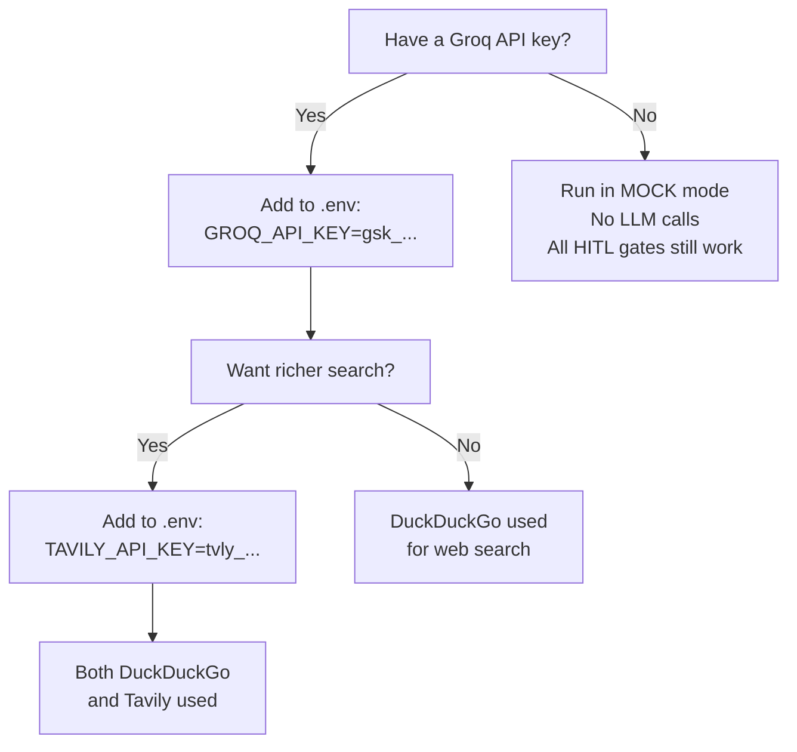

# 🔑 Configuration Guide

> **Back to** [Documentation Hub](README.md)

---

## How Configuration Works

The system reads all its settings from a file called `.env` in the project root. This is a simple text file where each line is:

```
VARIABLE_NAME=value
```

The `python-dotenv` library loads these values automatically when the system starts. You never need to set system-wide environment variables.

---

## The `.env` File

Copy `.env.example` to `.env` to get started:

```bash
cp .env.example .env   # macOS/Linux
copy .env.example .env # Windows
```

Here is the full `.env.example` with all supported variables:

```env
# ─────────────────────────────────────────────────────────────
#  Multi-Agent LangGraph System — Environment Variables
# ─────────────────────────────────────────────────────────────

# Required: Groq API key for LLM inference
GROQ_API_KEY=your_groq_key_here

# Optional: Tavily API key for web search (Research agent)
TAVILY_API_KEY=your_tavily_key_here
```

---

## Environment Variables Reference

### `GROQ_API_KEY` *(Required for LLM calls)*

| Property | Value |
|----------|-------|
| **Required?** | No (system works in MOCK mode without it) |
| **Where to get it** | [console.groq.com](https://console.groq.com) — free account |
| **Format** | `gsk_` followed by alphanumeric characters |
| **Example** | `GROQ_API_KEY=gsk_abc123xyz...` |

**What happens without it:**
- A yellow `WARN: GROQ_API_KEY not set — running in MOCK mode` message appears
- All agents use pre-written example outputs instead of calling the LLM
- All HITL gates still work normally
- Perfect for testing the UI and workflow without spending API credits

**What model is used:**
The system uses `llama-3.3-70b-versatile` — Groq's fastest and most capable model. This is hardcoded in the agents:

```python
_GROQ_MODEL = "llama-3.3-70b-versatile"
```

---

### `TAVILY_API_KEY` *(Optional)*

| Property | Value |
|----------|-------|
| **Required?** | No — DuckDuckGo is used by default for free |
| **Where to get it** | [tavily.com](https://tavily.com) — free tier available |
| **Format** | `tvly-` followed by alphanumeric characters |
| **Example** | `TAVILY_API_KEY=tvly-abc123xyz...` |

**What it does:**
When set, the `web_search` tool appends Tavily results to the DuckDuckGo results. This gives the Research Agent **richer, more curated** search results.

**Without it:**
Only DuckDuckGo is used. This is completely fine for most use cases.

---

## Where the `.env` File Is Loaded

The system looks for `.env` in two locations (in this order):

```python
load_dotenv(_ROOT.parent / ".env")      # parent directory first
load_dotenv(_ROOT / ".env", override=False)  # project root as fallback
```

So you can place `.env` either in:
- `multi-agent-system-for-cording/.env` ← recommended
- `multi-agent-system-for-cording/multi-agent-system/.env` ← fallback

---

## Configuration Checklist



---

## Security Rules for Your Keys

> ⚠️ **NEVER** commit your `.env` file to Git!

The `.gitignore` file already contains `.env` to protect you. Double-check with:

```bash
git status
# .env should NOT appear in the output
```

If you accidentally committed `.env`:
1. Remove it: `git rm --cached .env`
2. Commit the removal: `git commit -m "Remove accidentally committed .env"`
3. **Rotate your API keys immediately** — treat them as compromised

---

## Key Takeaways

> - Only `GROQ_API_KEY` is needed for full functionality
> - Without any keys, the system runs in **MOCK mode** (useful for testing)
> - `TAVILY_API_KEY` is optional — adds richer search results
> - Keep `.env` **out of Git** — it holds your private keys

---

**Next:** [API Documentation →](api-documentation.md)
