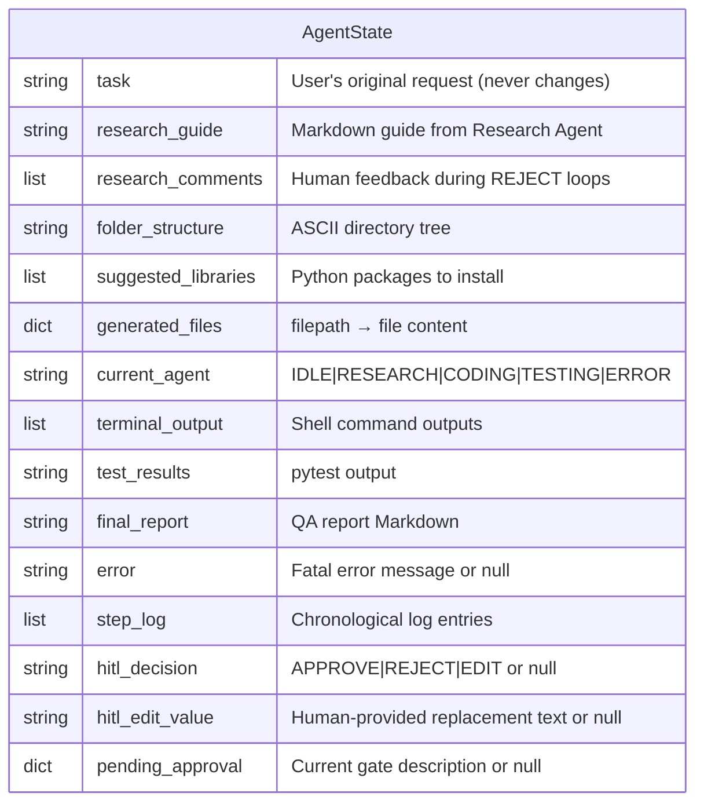
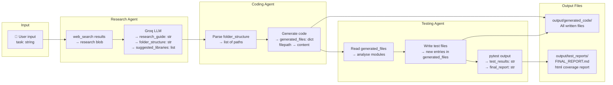
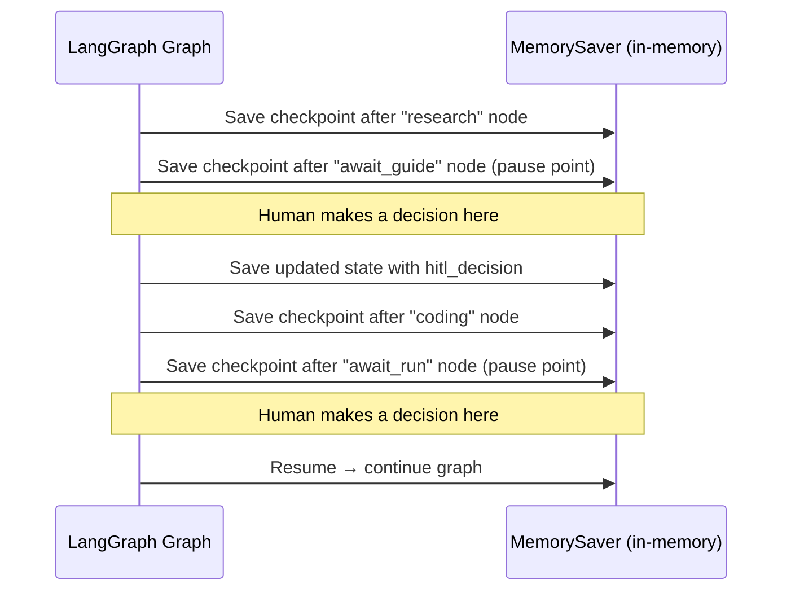

# 🗄️ Database Documentation

> **Back to** [Documentation Hub](README.md)

---

## Does This Project Have a Database?

The Multi-Agent System for Coding does **not use a traditional database** (like PostgreSQL or MySQL). Instead, it uses two forms of data storage:

1. **In-memory state** (`AgentState`) — lives while the pipeline runs
2. **LangGraph MemorySaver** — saves checkpoints to memory during the session

Both are **temporary** — they reset when you restart the program.

---

## Primary Data Store: AgentState

`AgentState` is a Python `TypedDict` that acts as the system's "database" while the pipeline runs. It is defined in `graph/state.py`.



---

## Data Flow Through the System

Here is how data enters, transforms, and exits the system:



---

## LangGraph MemorySaver — Checkpointing

LangGraph's `MemorySaver` is a **checkpoint system** that saves the `AgentState` to memory after every node in the graph executes.



**Key facts about MemorySaver:**
- Checkpoints exist **only in RAM** — they are lost when the program exits
- Each checkpoint is identified by a `thread_id` (hardcoded as `"pipeline-run"`)
- You can inspect the latest checkpoint with `graph.get_state(config)`
- Checkpoints allow the graph to **resume from a pause point** after a human decision

---

## Generated Files Store (`generated_files`)

The `generated_files` field in `AgentState` is a Python dictionary that maps relative file paths to their content:

```python
# Example contents of generated_files
{
    "app/main.py": "from fastapi import FastAPI\napp = FastAPI()\n...",
    "app/core/config.py": "from pydantic import BaseSettings\n...",
    "app/models/user.py": "from sqlalchemy import Column, String\n...",
    "tests/test_main.py": "import pytest\nfrom app.main import app\n...",
    "requirements.txt": "fastapi\nuvicorn\nsqlalchemy\n...",
}
```

These are also **written to disk** in `output/generated_code/` by the Coding Agent.

---

## HITL Audit Log

Every human decision is stored in `AgentUI._hitl_log` (in memory) and displayed at the end of the session:

```python
# Example HITL log entry
{
    "agent": "CODING",
    "action_type": "CREATE FILE",
    "decision": "APPROVE",
    "edited": False,
    "time": "14:32:01"
}
```

The `show_hitl_summary()` method renders this as a Rich table at the end.

---

## File Outputs

| File/Folder | Created by | Contents |
|------------|------------|---------|
| `output/generated_code/` | Coding Agent | The full generated project (all files) |
| `output/generated_code/tests/` | Testing Agent | pytest test files |
| `output/test_reports/FINAL_REPORT.md` | Testing Agent | QA summary (Markdown) |
| `output/test_reports/*.html` | pytest-html | HTML coverage report |

---

## Key Takeaways

> - There is **no traditional database** — state lives in Python dict during a run
> - `AgentState` is the central "database table" with 15 fields
> - `MemorySaver` checkpoints state in RAM so the pipeline can pause and resume
> - All generated files land in `output/generated_code/`
> - The HITL audit log is stored in `AgentUI._hitl_log` and displayed at session end

---

**Next:** [Deployment Guide →](deployment.md)
