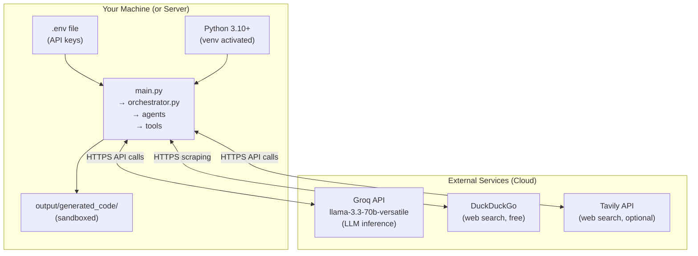

# 🚀 Deployment Guide

> **Back to** [Documentation Hub](README.md)

---

## What Does "Deployment" Mean Here?

This is a **command-line tool** that runs locally on your machine. It does not have a web server, a database cluster, or a cloud deployment in the traditional sense. However, this guide covers:

1. Running it reliably on your own machine (local "production")
2. Running it on a remote server (SSH session)
3. Packaging it as a Docker container
4. Suggested monitoring patterns

---

## Local "Production" Setup

For reliable local use, follow these extra steps beyond the basic installation:

### 1. Use a Dedicated Virtual Environment

```bash
python -m venv venv --upgrade-deps
source venv/bin/activate  # or .\venv\Scripts\Activate.ps1 on Windows
pip install -r requirements.txt
```

### 2. Keep API Keys in a Secure `.env`

Never hardcode keys in source files. Confirm `.env` is git-ignored:

```bash
grep ".env" .gitignore
# Should output: .env
```

### 3. Run with Output Logging

To capture what happens during a run:

```bash
python main.py 2>&1 | tee run_$(date +%Y%m%d_%H%M%S).log
```

On Windows PowerShell:
```powershell
python main.py 2>&1 | Tee-Object -FilePath "run_$(Get-Date -Format 'yyyyMMdd_HHmmss').log"
```

---

## Running on a Remote Server (SSH)

If you want to run the pipeline on a remote Linux server:

### 1. Connect and set up

```bash
ssh user@your-server.com
git clone https://github.com/RMCV-Rajapaksha/multi-agent-system-for-cording.git
cd multi-agent-system-for-cording/multi-agent-system
python3 -m venv venv
source venv/bin/activate
pip install -r requirements.txt
cp .env.example .env
nano .env  # Add your API keys
```

### 2. Use `tmux` to keep it running after disconnect

```bash
# Start a new tmux session
tmux new -s pipeline

# Run the system
python main.py

# Detach (keep running): press Ctrl+B, then D
# Reattach later:
tmux attach -t pipeline
```

---

## Docker Setup

Here is a `Dockerfile` to containerize the system:

```dockerfile
# Dockerfile
FROM python:3.11-slim

WORKDIR /app

# Install system dependencies
RUN apt-get update && apt-get install -y \
    git \
    && rm -rf /var/lib/apt/lists/*

# Copy requirements first (for caching)
COPY requirements.txt .
RUN pip install --no-cache-dir -r requirements.txt

# Copy project
COPY . .

# The system is interactive — it needs a terminal
CMD ["python", "main.py"]
```

Build and run:

```bash
docker build -t multi-agent-system .

# Run interactively (required — the system needs your input!)
docker run -it \
  -e GROQ_API_KEY=your_key_here \
  -e TAVILY_API_KEY=your_key_here \
  -v $(pwd)/output:/app/output \
  multi-agent-system
```

> ⚠️ **Important:** The `-it` flag is required because the system needs to accept keyboard input at HITL gates. Also mount the `output/` volume so generated files are accessible outside the container.

---

## Deployment Architecture



---

## Monitoring

Since this is a CLI tool, monitoring is done through logs and the Rich terminal output:

| What to monitor | How |
|-----------------|-----|
| Current pipeline stage | Aqua status cards on live dashboard |
| Agent reasoning | → thought lines in Reasoning panel |
| HITL decisions | Audit table printed at end of session |
| Generated files | File Workspace table on live dashboard |
| Errors | Red ✗ lines in Reasoning panel |
| Run log | Use `tee` to save terminal output to file |

---

## Known Limitations

| Limitation | Notes |
|-----------|-------|
| **No persistent state** | If the process crashes, the pipeline must restart from scratch |
| **Interactive only** | Cannot be run unattended — HITL gates require human input |
| **Rate limits** | Groq's free tier has limits; repeated runs in quick succession may fail |
| **DuckDuckGo rate limiting** | Aggressive use may trigger temporary blocks |
| **Windows encoding** | The code includes a UTF-8 fix, but some terminal emulators may still show garbled characters |

---

## Key Takeaways

> - This is a **local CLI tool** — no web server or cloud deployment needed
> - Use `tmux` for remote server runs
> - Use Docker with `-it` flag for containerized runs
> - Always mount `output/` as a Docker volume to access generated files
> - The system **cannot** run unattended (HITL gates need your input)

---

**Next:** [Security Documentation →](security.md)
