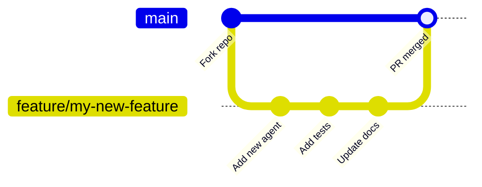

# 👨‍💻 Developer Guide

> **Back to** [Documentation Hub](README.md)

---

## Welcome, Developer!

This guide is for people who want to **extend, modify, or contribute** to the Multi-Agent System for Coding. You should be comfortable with Python.

---

## Development Environment Setup

Follow the [Installation Guide](installation.md) first, then:

```bash
# Clone the repo
git clone https://github.com/RMCV-Rajapaksha/multi-agent-system-for-cording.git
cd multi-agent-system-for-cording/multi-agent-system

# Create and activate venv
python -m venv venv
source venv/bin/activate  # or .\venv\Scripts\Activate.ps1 on Windows

# Install all deps including dev tools
pip install -r requirements.txt
pip install black isort mypy  # optional but recommended
```

---

## Codebase Overview

```mermaid
graph TD
    subgraph "Entry Points"
        M["main.py\n↳ calls run_pipeline()"]
        RA["agents/research_agent.py\n↳ if __name__ == '__main__'"]
        CA["agents/coding_agent.py\n↳ if __name__ == '__main__'"]
        TA["agents/testing_agent.py\n↳ if __name__ == '__main__'"]
    end

    subgraph "Core Logic"
        O["graph/orchestrator.py\n↳ StateGraph definition\n↳ run_pipeline()"]
        S["graph/state.py\n↳ AgentState TypedDict"]
    end

    subgraph "Agents"
        R["research_agent(state)"]
        C["coding_agent(state)"]
        T["testing_agent(state)"]
    end

    subgraph "Tools"
        ST["search_tools.py\n@tool web_search()\n@tool deep_search()"]
        TT["terminal_tools.py\n@tool run_command()"]
        FT["filesystem_tools.py\n@tool create_file()\n@tool create_directory()"]
    end

    subgraph "UI"
        UI["ui/terminal_ui.py\nAgentUI (Singleton)\nRich live layout"]
    end

    M --> O --> R & C & T
    R --> ST
    C --> ST & TT & FT
    T --> TT & FT
    R & C & T & O --> UI
    O --> S
```

---

## How to Add a New Agent

Adding a new agent (e.g., "Deployment Agent") takes 4 steps:

### Step 1: Create the agent file

```python
# agents/deployment_agent.py
from copy import deepcopy
from graph.state import AgentState
from ui.terminal_ui import AgentUI

ui = AgentUI()

async def deployment_agent(state: AgentState) -> AgentState:
    new_state = deepcopy(state)
    new_state["current_agent"] = "DEPLOYMENT"
    
    ui.show_step("DEPLOYMENT", "Deploying the project...")
    # ... your logic here ...
    
    new_state["current_agent"] = "IDLE"
    return new_state
```

### Step 2: Add a new field to AgentState (if needed)

```python
# graph/state.py — add your new field
class AgentState(TypedDict):
    # ... existing fields ...
    deployment_url: str | None   # ← add this
```

### Step 3: Wire the agent into the graph

```python
# graph/orchestrator.py
from agents.deployment_agent import deployment_agent

_workflow.add_node("deployment", deployment_agent)
_workflow.add_edge("complete", "deployment")  # runs after testing
_workflow.add_edge("deployment", END)
```

### Step 4: Update the UI status cards (optional)

```python
# ui/terminal_ui.py — add to _AGENT_LABELS
_AGENT_LABELS = {
    "RESEARCH":   "AGENT 1  *  RESEARCH",
    "CODING":     "AGENT 2  *  CODING",
    "TESTING":    "AGENT 3  *  TESTING",
    "DEPLOYMENT": "AGENT 4  *  DEPLOYMENT",  # ← add this
}
```

---

## How to Add a New Tool

Tools are LangChain `@tool` decorated functions that agents can call.

```python
# tools/my_new_tool.py
from langchain_core.tools import tool
from ui.terminal_ui import AgentUI

ui = AgentUI()

@tool
def my_tool(input_string: str) -> str:
    """
    One-sentence description for the LLM to understand what this tool does.

    Args:
        input_string: Description of this parameter.

    Returns:
        Description of what is returned.
    """
    ui.show_tool_call("my_tool", input_string)
    
    # Your logic here
    result = f"Processed: {input_string}"
    
    ui.show_result(result)
    return result
```

Then import and use it in the relevant agent:

```python
# agents/some_agent.py
from tools.my_new_tool import my_tool

result = my_tool.invoke({"input_string": "hello"})
```

---

## Coding Standards

| Standard | Rule |
|---------|------|
| **Formatting** | Use `black` with default settings |
| **Imports** | Sort with `isort` |
| **Type hints** | Use them for all function parameters and return types |
| **Docstrings** | Every public function needs a docstring |
| **Error handling** | Catch specific exceptions, not bare `except:` |
| **AgentUI** | Always use the Singleton — `ui = AgentUI()` at module level |
| **State mutations** | Always `deepcopy(state)` before modifying in agent functions |
| **HITL gates** | Every write/execute action must go through `ui.request_approval()` |

### Example of Good Code Style

```python
async def my_agent(state: AgentState) -> AgentState:
    """
    LangGraph node — does XYZ.

    Reads:  state["task"]
    Writes: state["result"]
    """
    new_state: AgentState = deepcopy(state)  # always deepcopy!
    step_log = list(state.get("step_log") or [])
    
    task = state.get("task", "").strip()
    if not task:
        new_state["error"] = "MyAgent: task is empty."
        return new_state
    
    ui.show_step("MY_AGENT", "Doing the thing...")
    
    try:
        result = do_something(task)
        step_log.append(f"[MY_AGENT] Result: {result}")
    except Exception as exc:
        ui.show_error(f"Failed: {exc}")
        new_state["error"] = str(exc)
        return new_state
    
    new_state["result"] = result
    new_state["step_log"] = step_log
    return new_state
```

---

## Testing Your Changes

### Unit test a single agent

```bash
python agents/research_agent.py
python agents/coding_agent.py
python agents/testing_agent.py
```

Each agent file has a standalone `if __name__ == "__main__"` block for testing.

### Unit test a single tool

```bash
python tools/search_tools.py
python tools/terminal_tools.py
python tools/filesystem_tools.py
```

### Test the full pipeline

```bash
python main.py
# Enter a simple task like: "Build a Python script that prints Hello World"
```

### Run the existing test suite

```bash
pytest --tb=short
```

---

## Development Workflow



1. **Fork** the repository on GitHub
2. **Create a branch:** `git checkout -b feature/my-feature-name`
3. **Make changes** following the coding standards above
4. **Test** with `python main.py` and `pytest`
5. **Update docs** in `docs/` if you changed any interfaces
6. **Submit a Pull Request** on GitHub with a clear description

---

## Understanding the HITL System

The HITL system is implemented in two layers:

### Layer 1: Direct `ui.request_approval()` calls

Used inside agents and tools for granular approvals (file-by-file, etc.):

```python
decision, edited = ui.request_approval(
    action_type="CREATE FILE",      # What category is this?
    details="File: app/main.py\n...",  # What exactly will happen?
    allow_edit=True                 # Can the human modify it?
)

if decision == "APPROVE":
    # write the file
elif decision == "EDIT" and edited:
    # write the edited version
elif decision == "REJECT":
    # skip this file
```

### Layer 2: LangGraph `interrupt()` calls

Used in the orchestrator for major pipeline checkpoints:

```python
# In orchestrator.py — pauses the ENTIRE graph
def await_guide(state: AgentState) -> dict:
    interrupt({"gate": "RESEARCH GUIDE", "details": guide, ...})
    return {}

# The runner in run_pipeline() handles these:
decision, edited = ui.request_approval(gate, details, allow_edit)
graph.update_state(config, {"hitl_decision": decision})
initial_input = Command(resume=True)  # resumes the graph
```

---

## Key Takeaways

> - Always `deepcopy(state)` before modifying in agent functions
> - All agents share the `AgentUI` Singleton — never create a new one
> - Every write/execute action **must** have a HITL gate
> - Add new agents to `graph/orchestrator.py` to wire them into the pipeline
> - Test each agent standalone using its `if __name__ == "__main__"` block

---

**Next:** [Glossary →](glossary.md)
