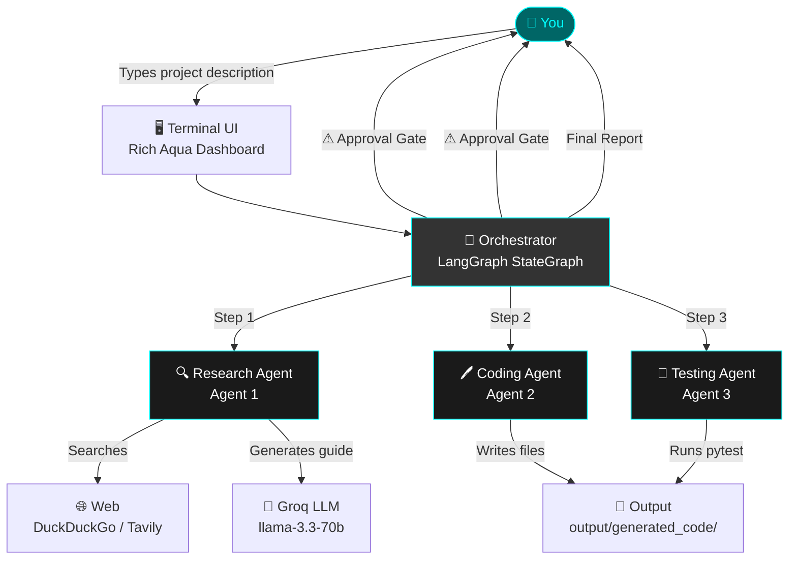
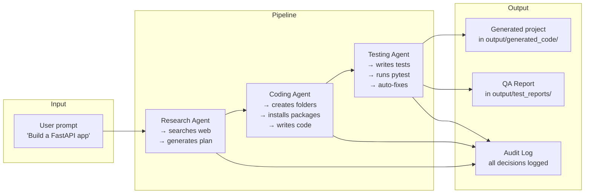

# 📋 Project Overview

> **Back to** [Documentation Hub](README.md)

---

## What Is This Project?

The **Multi-Agent System for Coding** is a smart assistant that can **build software projects for you automatically**.

You describe what you want — for example, *"Build a REST API with user login"* — and the system does the research, writes the code, and tests it. At every important step, **it asks for your approval** before taking any action.

Think of it like having three expert assistants working together:
1. A **researcher** who figures out the best approach
2. A **programmer** who writes the code
3. A **tester** who checks that everything works

---

## The Problem It Solves

Building a software project from scratch involves many steps:
- Researching the best tools and libraries
- Deciding on a project structure
- Writing code file by file
- Installing dependencies
- Testing for bugs

This is time-consuming and error-prone, especially for beginners. This system **automates all of these steps** while keeping a human in control of every important decision.

---

## Main Features

| Feature | Description |
|---------|-------------|
| 🔍 **Smart Research** | Searches the web (DuckDuckGo + optionally Tavily) for best practices |
| 🤖 **3 Specialized Agents** | Research, Coding, and Testing agents work as a team |
| ✅ **Human Approval Gates** | You approve, reject, or edit every action before it runs |
| 🔒 **Safe Sandbox** | All generated code is written to `output/generated_code/` only |
| 🚫 **Command Blocklist** | Dangerous commands (like `rm -rf /`) are always blocked |
| 🎨 **Beautiful Terminal UI** | Live dashboard with Aqua (#00FFFF) color theme |
| 📊 **Audit Log** | Every human decision is logged with a timestamp |
| 🔄 **Auto-Fix Loop** | If code fails, the system proposes fixes and asks for approval |

---

## High-Level Architecture

Here is a simple picture of how the system works:

---

## System Overview

Here is a more detailed view showing how data flows:

---

## Target Users

This project is designed for:

- 🎓 **Students** learning how to build software projects
- 🚀 **Entrepreneurs** who want to quickly prototype an idea
- 🔬 **Researchers** studying multi-agent AI systems
- 👨‍💻 **Developers** who want to speed up repetitive project setup tasks

---

## Project Goals

1. **Demonstrate** how multiple AI agents can collaborate on a complex task
2. **Show** how to safely integrate AI into a workflow without losing human control
3. **Provide** a reusable framework for building your own multi-agent coding tools
4. **Maintain** complete transparency — every action is logged and explained

---

## Key Takeaways

> - The system **never** modifies your machine without your permission
> - Every file it generates is isolated in `output/generated_code/`
> - Dangerous commands are **always blocked**, no matter what the AI proposes
> - You can **edit**, **reject**, or **approve** every step

---

**Next:** [System Architecture →](system-architecture.md)
