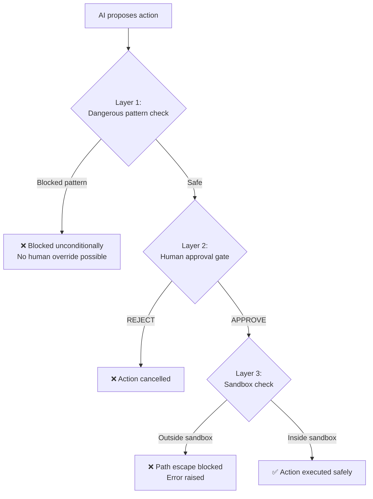

# 🔒 Security Documentation

> **Back to** [Documentation Hub](README.md)

---

## Security Philosophy

This system is designed with a simple principle: **the AI should never be able to cause harm without explicit human permission**.

Every safety mechanism exists to enforce this principle.

---

## Security Layers



---

## Layer 1: Command Blocklist

Before a shell command is even shown to the human, `terminal_tools.py` checks it against a list of dangerous patterns:

| Pattern | What it prevents |
|---------|-----------------|
| `rm -rf /` | Deleting the entire filesystem |
| `sudo` | Escalating to root/administrator |
| `format` | Formatting disk drives |
| `mkfs` | Creating new filesystems (wipes data) |
| `dd of=/dev/` | Writing directly to block devices |
| `shutdown` | Shutting down the machine |
| `reboot` / `halt` | Restarting the machine |

These are **always blocked** — no human can override them by typing APPROVE. The code will raise `ValueError` instead.

```python
# Simplified from terminal_tools.py
_DANGEROUS_PATTERNS = [
    re.compile(r"\brm\s+-[a-zA-Z]*r[a-zA-Z]*f\s+/"),
    re.compile(r"\bsudo\b"),
    re.compile(r"\bformat\b", re.IGNORECASE),
    # ... more patterns
]

def _is_dangerous(cmd: str) -> bool:
    return any(pat.search(cmd) for pat in _DANGEROUS_PATTERNS)
```

---

## Layer 2: Human-in-the-Loop (HITL) Gates

Every action that modifies the system — writing files, running commands, installing packages — requires **explicit human approval**.

This means:
- The AI **cannot** write files autonomously
- The AI **cannot** run `pip install` autonomously
- The AI **cannot** execute any shell command autonomously

The human must type `APPROVE`, `REJECT`, or `EDIT` at every gate. Every decision is logged with a timestamp.

---

## Layer 3: Filesystem Sandbox

All file write operations are restricted to a single directory:

```
output/generated_code/
```

This is enforced in `filesystem_tools.py` using path resolution:

```python
_SANDBOX = Path(__file__).resolve().parents[1] / "output" / "generated_code"

def _safe_path(path: str) -> Path:
    resolved = (_SANDBOX / path).resolve()
    try:
        resolved.relative_to(_SANDBOX.resolve())
    except ValueError:
        raise ValueError(f"Path escape attempt blocked.")
    return resolved
```

**What this blocks:**
- `../../../Windows/System32/evil.py` → blocked
- `C:\Users\admin\evil.py` → blocked
- `output/generated_code/app/main.py` → ✅ allowed

---

## API Key Security

### Where Keys Are Stored

API keys are stored **only in `.env`** — never in source code.

```env
# .env (never committed to Git)
GROQ_API_KEY=gsk_...
TAVILY_API_KEY=tvly_...
```

### Protection Measures

1. **`.gitignore`** — `.env` is listed so it cannot be accidentally committed
2. **`.env.example`** — Contains only placeholder values (safe to commit)
3. **In-code check** — If key equals `"your_groq_key_here"`, the system treats it as missing and runs in MOCK mode

### Key Rotation

If you suspect a key is compromised:
1. Go to [console.groq.com](https://console.groq.com) and revoke the old key
2. Generate a new key
3. Update your `.env` file
4. Never paste keys in chat, email, or GitHub issues

---

## Network Security

The system makes HTTPS calls to:

| Service | Purpose | Data sent |
|---------|---------|-----------|
| `api.groq.com` | LLM inference | Your task description + web search results |
| `duckduckgo.com` | Web search | Your search queries |
| `api.tavily.com` (optional) | Web search | Your search queries |

**Data privacy:**
- No personal data is sent to these services unless it appears in your task description
- DuckDuckGo does not track users (that's its selling point)
- Groq's data retention policy: check their [privacy policy](https://groq.com/privacy-policy/)

---

## Command Execution Security

All shell commands:
1. Run in a **subprocess** with `shell=True` (required for compound commands)
2. Have a **60-second timeout** (avoids hanging forever)
3. Run in the `output/generated_code/` directory by default (Coding Agent)
4. Cannot escalate privileges (no `sudo` allowed)

---

## What This System Cannot Protect Against

Be aware of these limitations:

| Risk | Description |
|------|-------------|
| **Social engineering** | If the LLM generates a script that asks you to run it manually outside the system, that script has no safety controls |
| **Insider threat** | If someone modifies `terminal_tools.py` to remove the blocklist, protection is gone |
| **Memory-only state** | Audit logs are lost on program exit |
| **API key leakage via logs** | If you log full state, API keys in env vars might appear |

---

## Security Best Practices for Users

✅ **Do:**
- Read the preview before approving any file
- Read the command before approving any shell execution
- Keep your `.env` file private
- Use a virtual environment to isolate dependencies

❌ **Don't:**
- Blindly approve all gates without reading the details
- Run the system as root/administrator
- Commit `.env` to version control
- Share your `output/` folder if it contains sensitive code

---

## Key Takeaways

> - **3 security layers:** blocklist → human approval → sandbox
> - Dangerous commands are **always blocked** — no override
> - All file writes go to `output/generated_code/` only
> - API keys live in `.env` only — never in source code
> - You must read and approve every action before it runs

---

**Next:** [Troubleshooting Guide →](troubleshooting.md)
