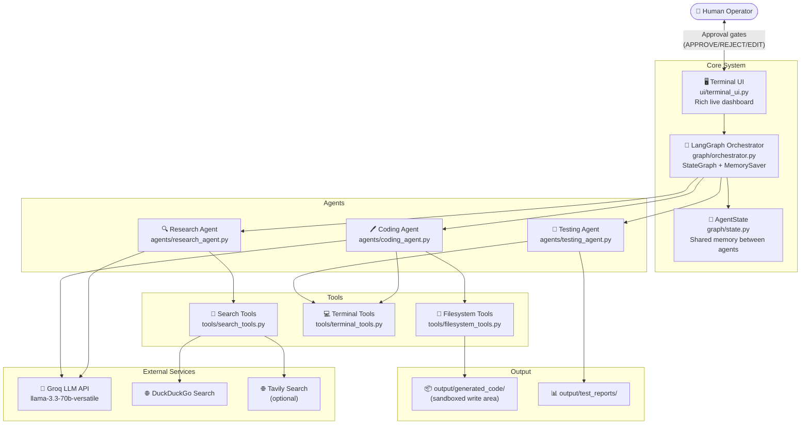
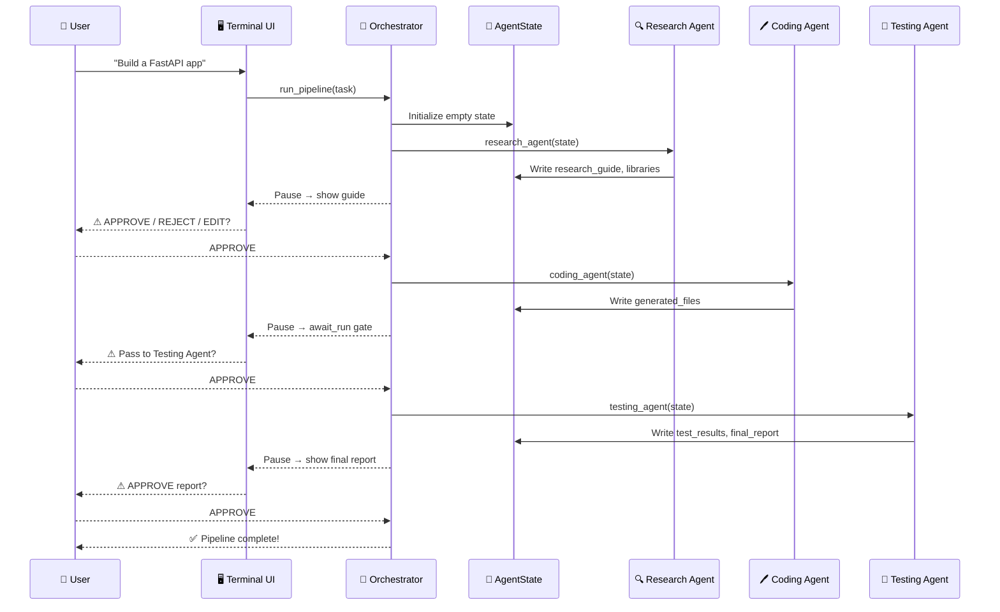

# 🏛️ System Architecture

> **Back to** [Documentation Hub](README.md)

---

## What Is System Architecture?

"Architecture" just means **how the parts of a system are organized and how they talk to each other**.

Imagine building a house. Before you start, you draw a blueprint that shows where the rooms go, where the electricity runs, and where the pipes are. System architecture is the same idea — but for software.

---

## The Big Picture

The system is built around a **central orchestrator** (like a project manager) that tells three AI agents what to do, one after another.

---

## Components

### 1. Terminal UI (`ui/terminal_ui.py`)

This is what you **see on screen**. It is built with the [Rich](https://github.com/Textualize/rich) Python library and has an Aqua (`#00FFFF`) color theme.

Key jobs:
- Shows a live dashboard with agent status cards
- Displays reasoning thoughts and web search results
- **Pauses** the pipeline and asks for your decision at every HITL (approval) gate
- Logs every decision with a timestamp
- Uses the **Singleton pattern** — there is always only one instance shared by all agents

### 2. LangGraph Orchestrator (`graph/orchestrator.py`)

This is the **pipeline manager**. It uses [LangGraph](https://langchain-ai.github.io/langgraph/), which lets you connect AI agents in a directed graph.

Key jobs:
- Defines the order: Research → Coding → Testing
- Creates "pause points" (called `interrupt()`) where a human must decide what happens next
- Saves the pipeline state after every step using `MemorySaver` (so it can resume from the exact same place)
- Routes between agents based on human decisions (e.g., if you REJECT the research guide, it goes back to the Research Agent)

### 3. AgentState (`graph/state.py`)

This is the **shared notebook** that all agents read from and write to.

| Field | Type | What it stores |
|-------|------|----------------|
| `task` | `str` | The original user request |
| `research_guide` | `str` | The implementation plan from Research Agent |
| `folder_structure` | `str` | The proposed file/folder tree |
| `suggested_libraries` | `list[str]` | Python packages to install |
| `generated_files` | `dict` | All code files generated so far |
| `test_results` | `str` | Output from pytest |
| `final_report` | `str` | The QA report from Testing Agent |
| `hitl_decision` | `str` | Last human choice (APPROVE/REJECT/EDIT) |
| `step_log` | `list[str]` | History of every action |
| `error` | `str\|None` | Any fatal error message |

### 4. Research Agent (`agents/research_agent.py`)

- Searches the web using **4 targeted queries** (architecture, libraries, pitfalls, folder structure)
- Feeds results to the Groq LLM to generate an **Implementation Guide**
- Guide has 6 sections: Overview, Libraries, Folder Structure, Steps, Challenges, Complexity

### 5. Coding Agent (`agents/coding_agent.py`)

- Reads the approved guide from `AgentState`
- Creates directories, installs packages, generates code files
- Runs the project with a 5-second timeout auto-detect
- Proposes auto-fixes when the project crashes (up to 3 attempts)

### 6. Testing Agent (`agents/testing_agent.py`)

- Scans all files in `generated_files`
- Writes `pytest` test files for every module
- Runs tests and parses coverage
- Auto-fixes failing tests
- Writes a final Markdown QA report

---

## Communication Flow

Here is how data moves between the components during a typical run:

---

## Why LangGraph?

LangGraph is a Python library that lets us define AI workflows as a **graph** (a set of connected boxes). This is better than a simple script because:

1. **State is saved automatically** at every checkpoint — if something crashes, you can resume
2. **Conditional branching** is easy — e.g., "if rejected, go back to Research"
3. **Interrupt support** — the graph can genuinely pause and wait for a human

---

## Key Takeaways

> - The system has **one orchestrator** managing **three agents** in sequence
> - All agents share a single **AgentState** object (like a shared whiteboard)
> - The pipeline can **pause and resume** at any point thanks to LangGraph's MemorySaver
> - All file writes are **locked to a sandbox folder** — nothing else can be touched

---

**Next:** [Agent Architecture →](agent-architecture.md)
