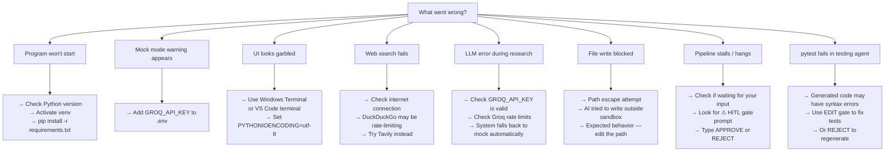

# 🛠️ Troubleshooting Guide

> **Back to** [Documentation Hub](README.md)

---

## Quick Diagnosis

Use this flowchart to find your problem quickly:



---

## Common Issues and Fixes

### 1. `ModuleNotFoundError: No module named 'langgraph'`

**Problem:** Python cannot find the required packages.

**Fix:**
```bash
# Make sure venv is activated (you should see (venv) in your prompt)
source venv/bin/activate   # macOS/Linux
.\venv\Scripts\Activate.ps1  # Windows

# Install packages
pip install -r requirements.txt
```

---

### 2. `WARN: GROQ_API_KEY not set — running in MOCK mode`

**Problem:** The system cannot find your Groq API key.

**This is a warning, not an error.** The system still runs — it uses pre-written example outputs instead of the real LLM.

**Fix (to use real LLM):**
```bash
# 1. Get a key at https://console.groq.com (free)
# 2. Add it to .env
echo "GROQ_API_KEY=gsk_your_key_here" >> .env
```

---

### 3. Garbled or Missing Characters in the Terminal (Windows)

**Problem:** You see `?` boxes or missing Unicode characters in the Aqua UI.

**Fixes:**
1. Use **Windows Terminal** (not the old `cmd.exe`)
2. Or use the VS Code integrated terminal
3. Or set the encoding before running:
   ```powershell
   $env:PYTHONIOENCODING = "utf-8"
   python main.py
   ```

---

### 4. DuckDuckGo Search Returns Empty Results or Errors

**Problem:** The Research Agent's web searches are failing.

**Possible causes:**
- Your internet connection is unstable
- DuckDuckGo is temporarily rate-limiting your IP
- Corporate firewall blocking the requests

**Fixes:**
1. Wait 5-10 minutes and try again
2. Set up Tavily as a backup:
   ```env
   TAVILY_API_KEY=tvly_your_key_here
   ```
3. The Research Agent will still work with empty search results — it falls back to the LLM's built-in knowledge

---

### 5. Groq API Error (AuthenticationError, RateLimitError)

**Problem:** The LLM call fails.

**Possible messages:**
- `AuthenticationError: Invalid API key`
- `RateLimitError: Rate limit exceeded`
- `ServiceUnavailableError: Service temporarily unavailable`

**Fixes:**

| Error | Fix |
|-------|-----|
| Invalid API key | Check your key at console.groq.com — make sure it starts with `gsk_` |
| Rate limit | Wait a few minutes (Groq's free tier has per-minute limits) |
| Service unavailable | Check [status.groq.com](https://status.groq.com) — try again later |

The system **automatically falls back to MOCK mode** if any LLM call fails, so the pipeline continues.

---

### 6. `ValueError: Path escape attempt blocked`

**Problem:** The Coding Agent tried to write a file outside the sandbox.

**Example:** The AI generates a path like `../../config.py` instead of `app/config.py`.

**Why this happens:** The LLM occasionally produces incorrect paths, especially for nested directories.

**Fix:** When the `CREATE FILE` gate appears, choose `EDIT` and type the correct path:
```
> EDIT
Enter replacement value. Type ---END---:
> app/config.py
> ---END---
```

---

### 7. Pipeline Appears to Hang / Stall

**Problem:** Nothing is happening — the terminal seems frozen.

**Most likely cause:** The system is waiting for your input at a HITL gate!

**What to look for:**
- The live dashboard will show agent status as **WAITING** (in yellow)
- Scroll up in your terminal — the approval panel may be above the visible area

**Fix:** Scroll up in your terminal and look for the `⚠ HUMAN APPROVAL REQUIRED` panel. Type `APPROVE` or `REJECT` and press Enter.

---

### 8. `HumanRejectedError` Stops the Pipeline

**Problem:** You typed `REJECT` and the pipeline stopped.

**This is expected behavior.** A REJECT on certain critical gates (like "Run Project" or "Create Folder Structure") stops the pipeline.

**Fix:** Restart `python main.py` and type `APPROVE` or `EDIT` at those gates.

---

### 9. Generated Code Has Syntax Errors

**Problem:** The Testing Agent reports pytest failures due to syntax errors in generated files.

**Why this happens:** The LLM occasionally generates slightly incorrect code, especially for complex projects.

**Fix:**
1. At the `CREATE FILE` gate, choose `EDIT` and fix the code before writing it
2. Or use the auto-fix loop: when pytest fails, approve the proposed fix
3. Or manually edit the files in `output/generated_code/` and re-run pytest

---

### 10. `pip install` Failed

**Problem:** The Coding Agent's package installation step fails.

**Common causes:**
- No internet connection
- Package name was wrong (LLM hallucinated a package that doesn't exist)
- Python version incompatibility

**Fix:**
1. At the `PACKAGE INSTALLATION` gate, choose `EDIT`
2. Remove any packages you don't recognize or that don't exist on PyPI
3. Type `---END---` to confirm

---

## Frequently Asked Questions

### Q: Can I run this without an internet connection?
**A:** Partially. The web search will fail (or return empty), but the LLM calls to Groq still require internet. In MOCK mode (no Groq key), the system works fully offline.

### Q: Can I run multiple pipelines at the same time?
**A:** No. The `AgentUI` Singleton and LangGraph's `thread_id = "pipeline-run"` are shared. Running two instances simultaneously would cause conflicts.

### Q: Where are my generated files?
**A:** They are in `output/generated_code/`. The exact folder structure depends on what the Research Agent proposed.

### Q: Can the system overwrite my own project files?
**A:** No. The filesystem sandbox (`output/generated_code/`) prevents any writes to files outside that folder. Your project files are safe.

### Q: The LLM generated wrong code. How do I fix it?
**A:** Use the `EDIT` option at the `CREATE FILE` gate to paste your corrected version before the file is written to disk.

### Q: How do I restart just the Testing Agent without redoing everything?
**A:** Currently, there is no way to resume from a specific step after the process exits — you would need to restart from the beginning. (Future feature: persistent MemorySaver with SQLite.)

---

## Getting More Help

If your issue is not listed here:

1. Check the [Glossary](glossary.md) to make sure you understand the terms used
2. Read the [Developer Guide](developer-guide.md) if you want to dig into the code
3. Open an issue on [GitHub](https://github.com/RMCV-Rajapaksha/multi-agent-system-for-cording/issues) with:
   - The error message (full traceback)
   - The steps you took before the error
   - Your OS and Python version

---

**Next:** [Developer Guide →](developer-guide.md)
