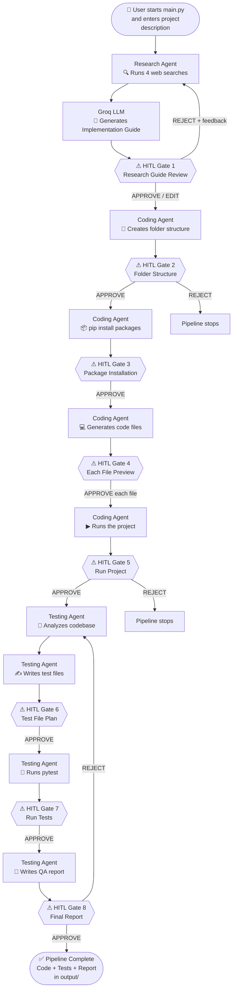
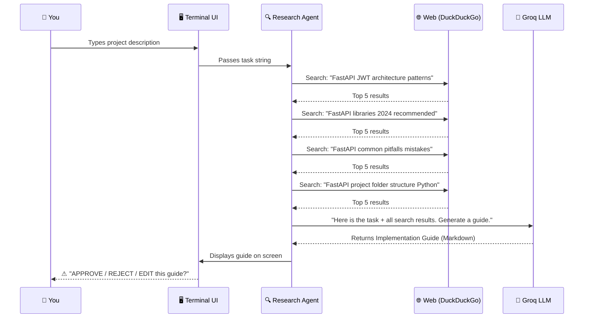
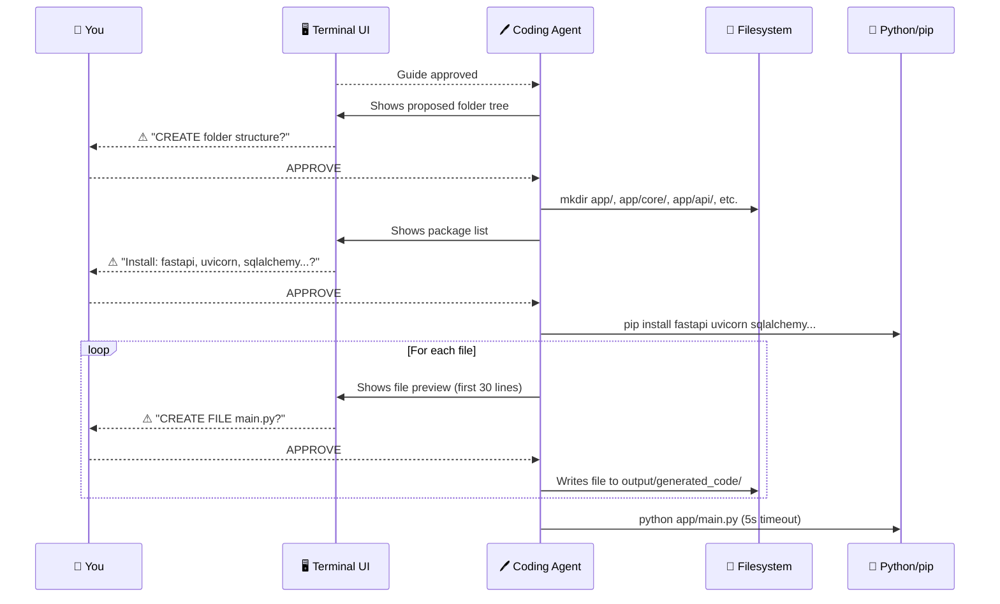
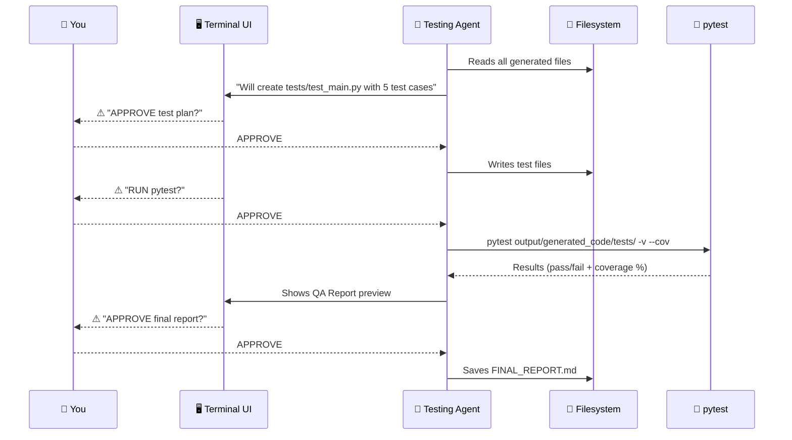
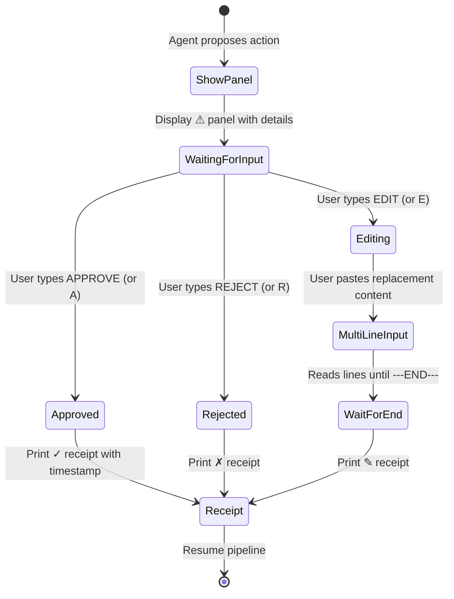
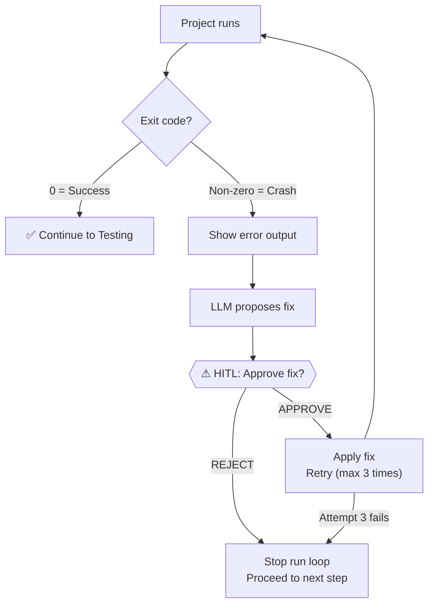

# 🔄 Workflows

> **Back to** [Documentation Hub](README.md)

---

## What Is a Workflow?

A workflow is the **sequence of steps** the system follows from the moment you type a project description to the moment the code is ready and tested.

This document explains every stage of that journey.

---

## End-to-End Workflow

Here is the full picture — from your first input to the finished project:



---

## User Request Lifecycle

Let's trace what happens when you type: *"Build a FastAPI REST API with JWT authentication"*

### Phase 1: Research (approx. 30-60 seconds)



### Phase 2: Coding (approx. 1-3 minutes)



### Phase 3: Testing (approx. 30-60 seconds)



---

## Approval Process

Every HITL (Human In The Loop) gate works the same way:



### What you type

| Input | Meaning |
|-------|---------|
| `APPROVE` or `A` | Go ahead — run this action |
| `REJECT` or `R` | Do not run this — skip or stop |
| `EDIT` or `E` | I want to change it — show me the input prompt |

### Multi-line EDIT

When you choose `EDIT`, you can paste multiple lines. Type `---END---` on its own line to finish:

```
> EDIT
Enter replacement value. Type ---END--- on its own line when finished:
> from fastapi import FastAPI
> app = FastAPI()
> 
> @app.get("/")
> def root():
>     return {"message": "Hello"}
> ---END---

✎ Human edited CREATE FILE → main.py at 14:32:01
```

---

## Error Handling



The system tries up to **3 automatic fixes** before giving up. You approve each fix before it is applied.

---

## Key Takeaways

> - There are **8+ HITL gates** in a typical pipeline run
> - You can `EDIT` any proposed content — you are always in control
> - The pipeline can **go backwards** (e.g., REJECT the guide → regenerate)
> - If the project crashes, the system tries to **auto-fix** it (with your permission)
> - All output is written to `output/generated_code/` — nothing else is touched

---

**Next:** [Folder Structure →](folder-structure.md)
